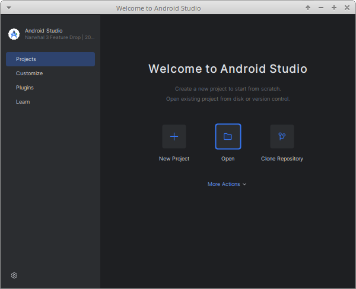
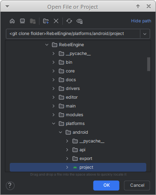
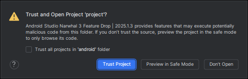
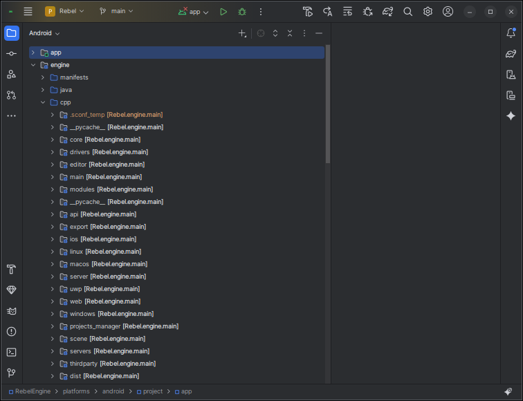
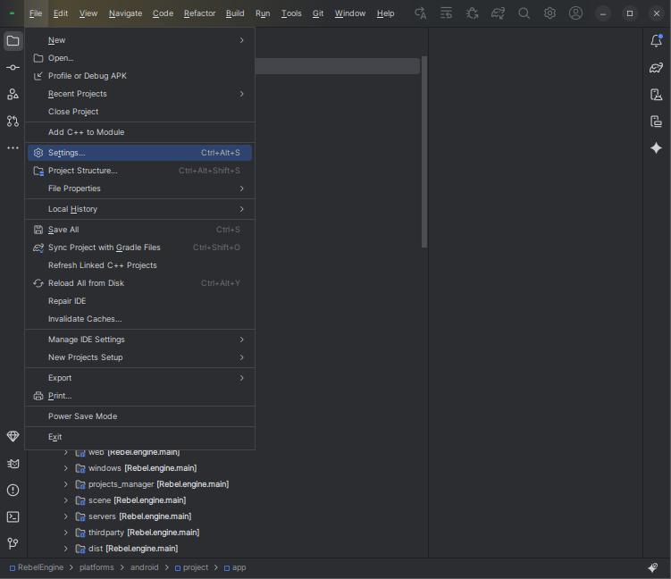
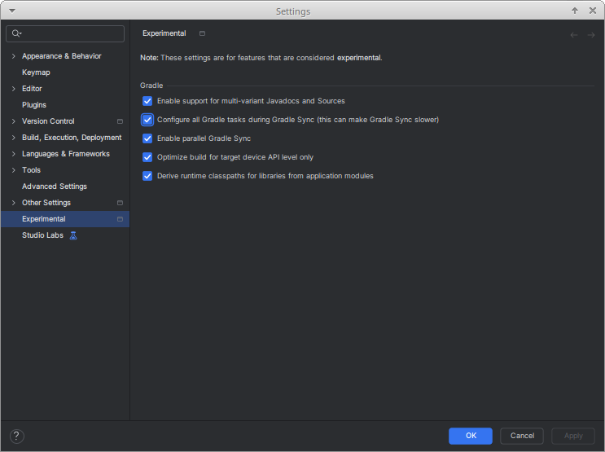
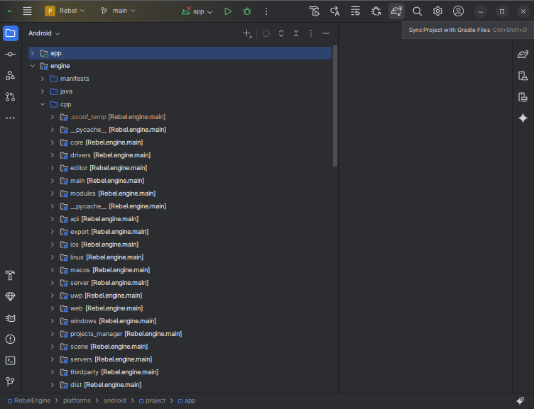
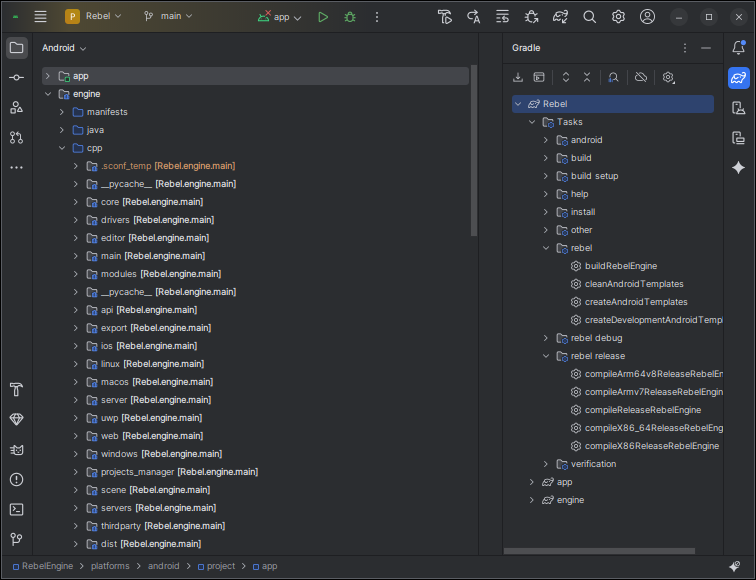

Android Studio
==============

`Android Studio <https://developer.android.com/studio>`_ is a free `JetBrains <https://www.jetbrains.com/>`_ IDE for Android app development.
Android Studio can also be used to develop C and C++ dynamic libraries that are packaged with Android app using the Android NDK.
Rebel Engine for Android is a C++ library compiled using the NDK.
If you want to contribute to Rebel Engine for Android,
it makes sense to use Android Studio.

Open the Rebel Android project
------------------------------

In the **Welcome to Android Studio** window,
select **Open**.

In the **Open File or Project** window,
from the RebelEngine root folder,
browse to and select the `platforms/android/project` folder.

Click **OK**.

Click **Trust Project** when asked whether to **Trust and Open Project 'project'?**

Wait for Android Studio to import the Gradle project.
When complete,
the Rebel Engine source code can be found in the **engine** module's **cpp** folder.

Configure the Rebel Gradle tasks
--------------------------------

We have created a number of Gradle tasks to build debug and release versions of Rebel Engine for Android for each of the supported targets.
There are also tasks for building all the targets simultaneously.
In addition,
there are tasks to create the release and debug Rebel Android templates.

To configure the Gradle tasks in Android Studio,
you will need to enable the Gradle Setting.
From the menu select **File > Settings...**.

Under **Experimental**,
enable **Configure all Gradle tasks during Gradle Sync (this can make Gradle Sync slower)**.

Click **OK** to save the setting.

Sync the project with Gradle again.

Under the Gradle menu,
you will now see all the Rebel Android tasks.

Hover over the tasks to see a description.

That's it!
You're now ready to start contributing to Rebel Engine for Android using Android Studio.

