CLion
=====

`CLion <https://www.jetbrains.com/clion/>`_ is a commercial `JetBrains <https://www.jetbrains.com/>`_ IDE for C++.

Open the Rebel Engine project
-----------------------------

In the **Welcome to CLion** window,
select **Open**.

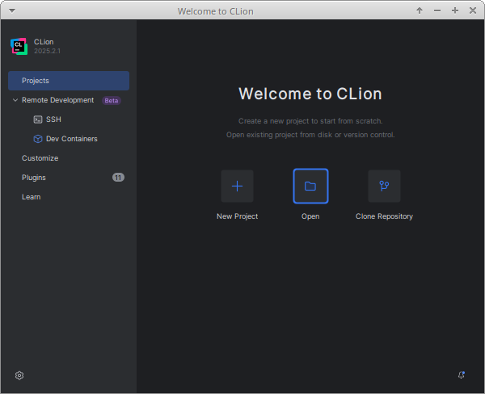

In the **Open File or Project** window,
browse to and select the `RebelEngine` root folder.

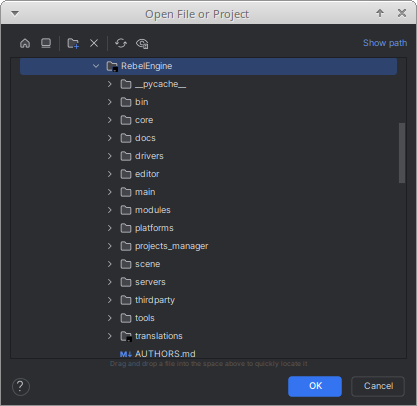

Click **OK** to open the project.

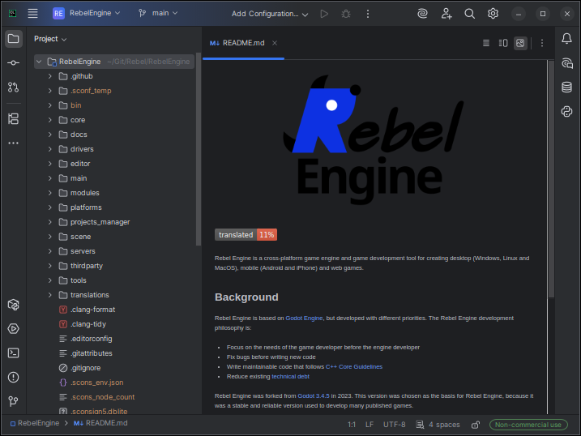

Create a Build Configuration
----------------------------

Rebel Engine uses `SCons <https://scons.org/>` as the :doc:`build system </development/compiling/introduction_to_the_buildsystem>`.
We need to create the build configurations manually.
From the **Add Configuration...** menu, select **Edit Configurations...**.

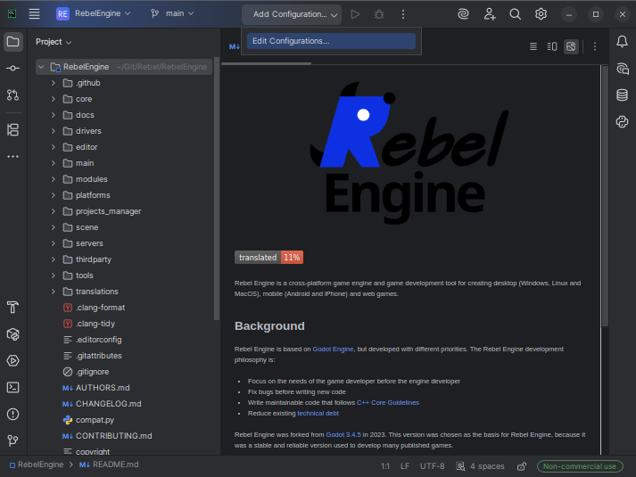

From **Add new run configuration...**, select **Custom Build Application**.

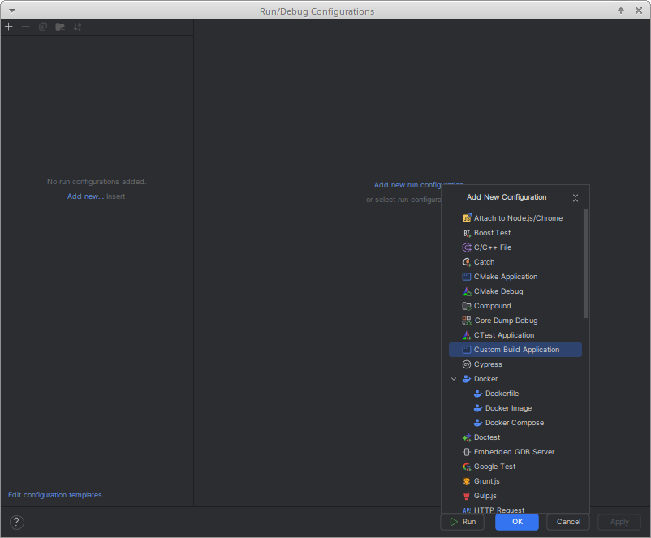

You will probably create multiple build configurations.
Name each run configuration, so you can easily identify it.

Each run configuration needs a build target.
Select **Configure Custom Build Targets**.

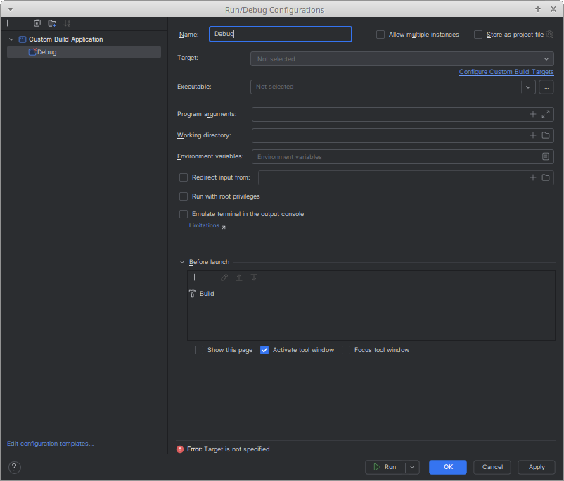

From **Add target**, select **Tool**.

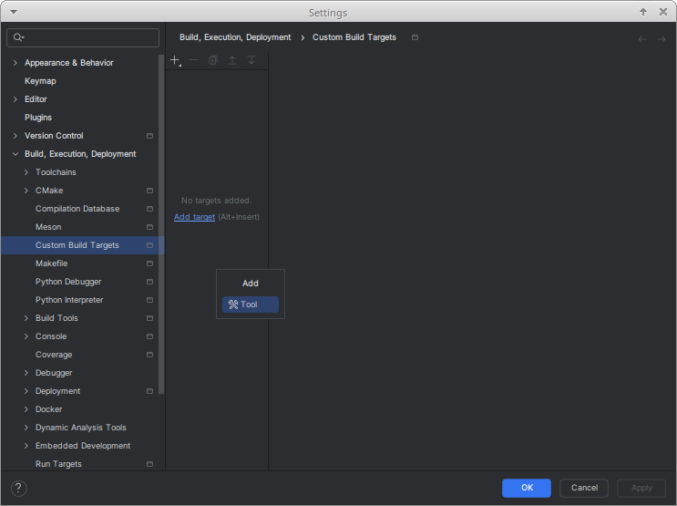

Name your build target.
It makes sense to give your build targets the same name as your run targets.

You will need to create a new build tool.
To the right of the **Build** drop-down list,
click the three dots: **...**.

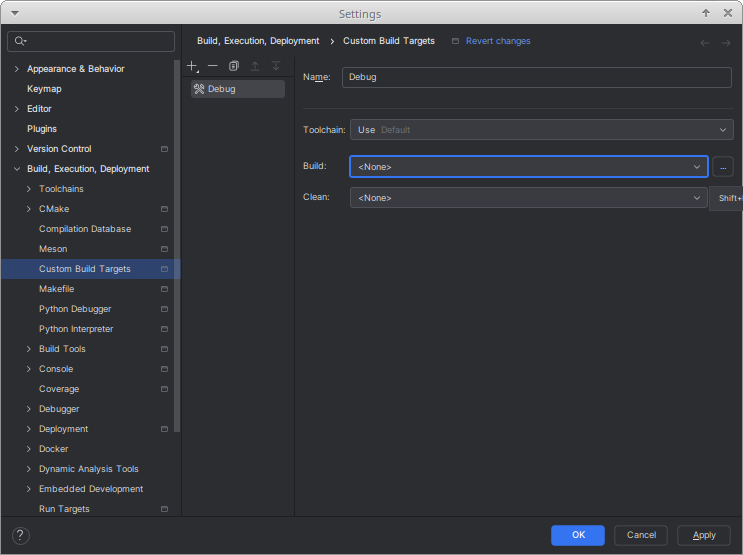

Click **Add**.

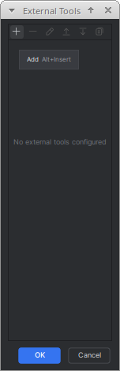

Name your build tool.
Again, it makes sense to give your tools the same name as your targets.

Under **Tool Settings**, **Program**, type ``scons``.
Under **Arguments** enter the arguments for this target.
For more information on the arguments available, see :doc:`/development/compiling/introduction_to_the_buildsystem`.

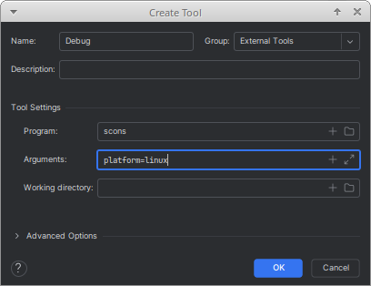

Click **OK** to save the build tool.

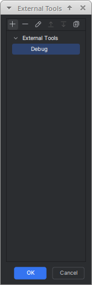

Click **OK** to select your new build tool.

Now, create a new clean tool.
To the right of the **Clean** drop-down list,
click the three dots: **...**.

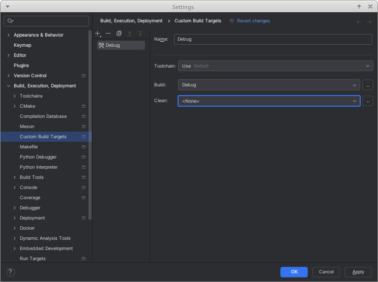

Name your clean tool.
It makes sense to give your clean tool the same name as your build tool, but add `Clean` to the name.
Use the same arguments for the build tool, but add the ``--clean`` argument.

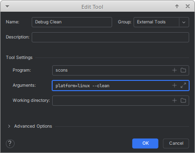

Click **OK** to save the clean tool.

When you have finished creating and selecting the build and clean tools,
click **OK** to save the new build target.

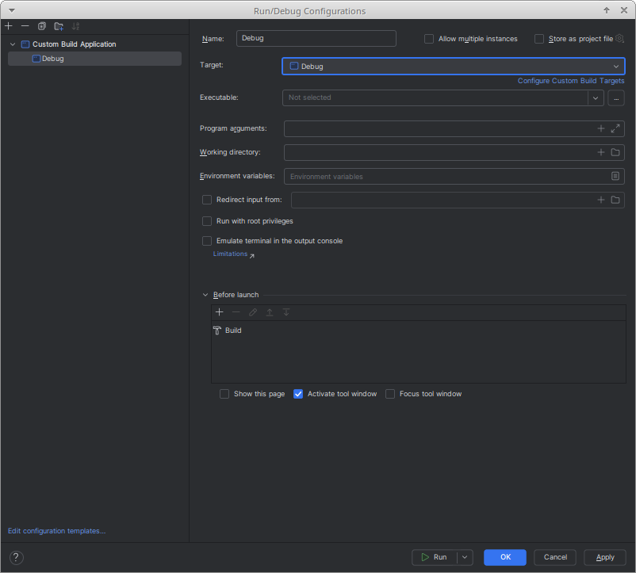

You can now select your new target for your run configuration.
Click **OK** to save your configuration.

Run and Debug Rebel Editor
--------------------------

Once you have created a build target,
you can build your selected configuration.
If you want to run and debug a Rebel Editor build on your platform,
you will need to specify the executable created.

Although you can simply enter the location and name of the executable,
it is easiest if you build Rebel Editor first.
Once you have completed the build, you can add the executable by browsing to it.

Edit your configuration.
If you try run a configuration without specifying the executable,
you will be prompted to add an executable.

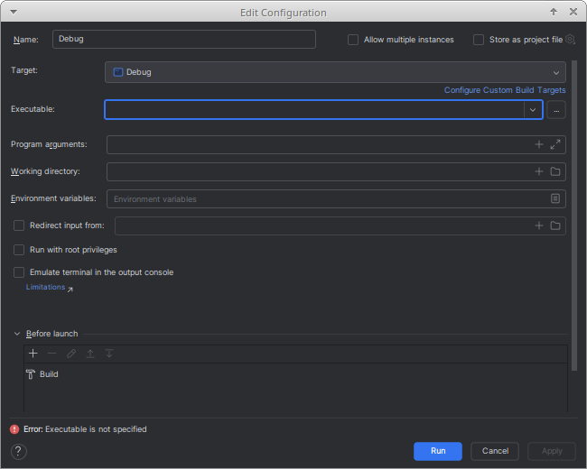

To the right of the **Executable** drop-down list,
click the three dots: **...**.

Browse to the `bin` folder,
and select the created executable.

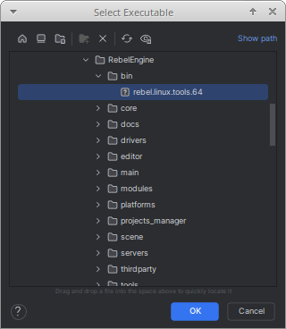

Click **OK** to save the specified executable for your configuration.
You will now be able to run and debug the Rebel Editor build.

There are two additional configuration fields worth noting:

1. The **Program arguments** field can be used to run and debug Rebel Editor with additional program arguments.

2. If required, the **Working directory** field can be used to test specific projects. Set it to the folder containing the ``project.rebel`` file.

That's it! You're now ready to start contributing to Rebel Engine using the CLion IDE.
