CLion
=====

`CLion <https://www.jetbrains.com/clion/>`_ is a commercial `JetBrains <https://www.jetbrains.com/>`_ IDE for C++.

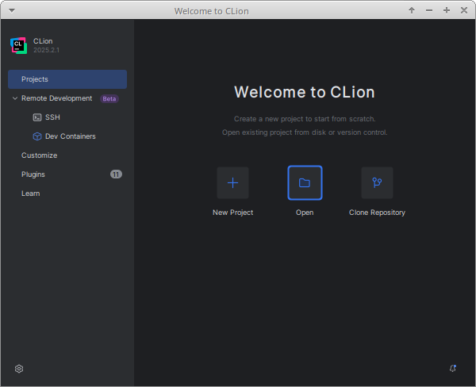

.. figure:: img/clion-open-file-or-project.png
   :figclass: figure-w480
   :align: center

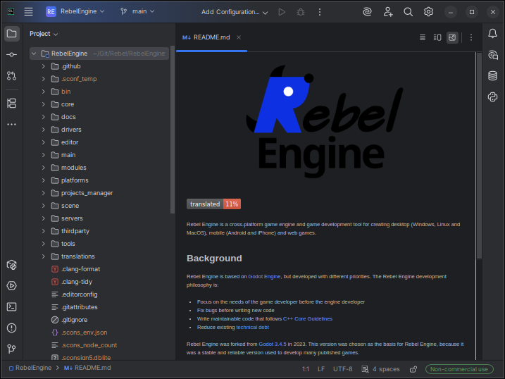

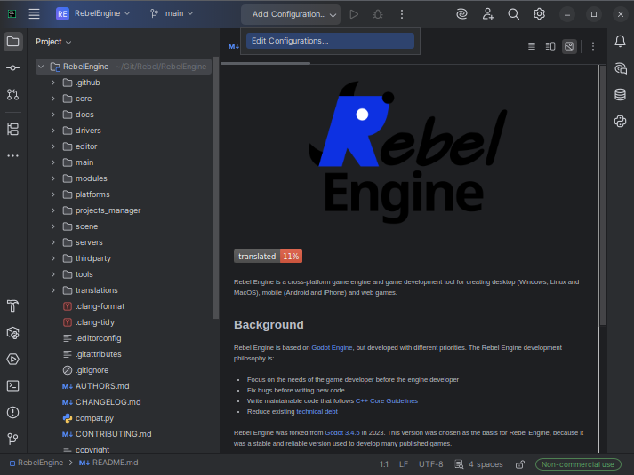

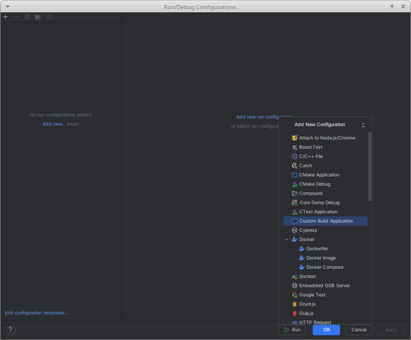

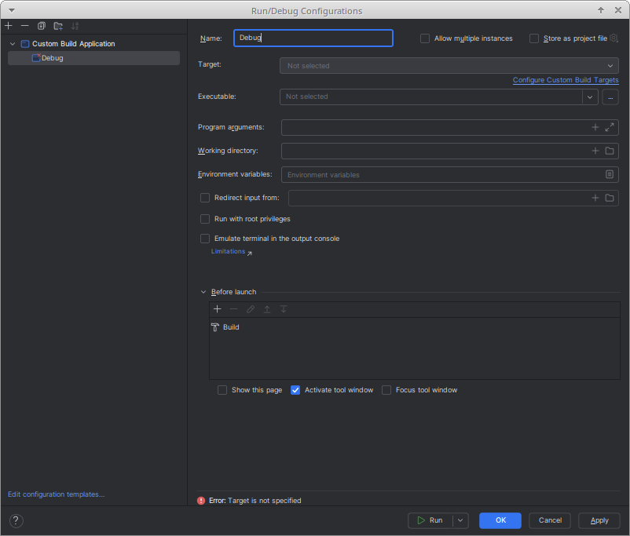

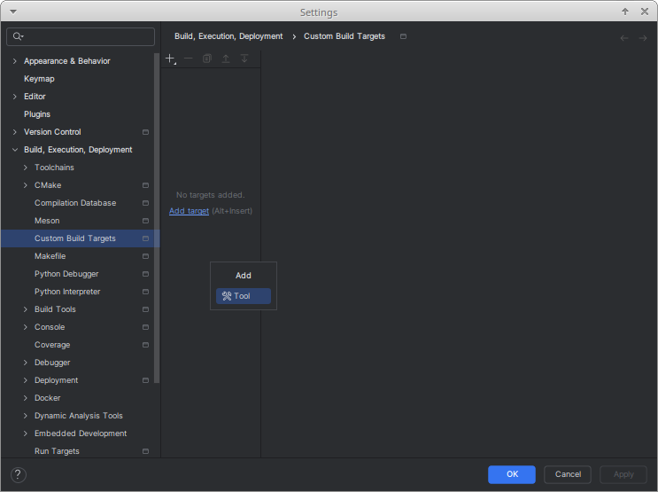

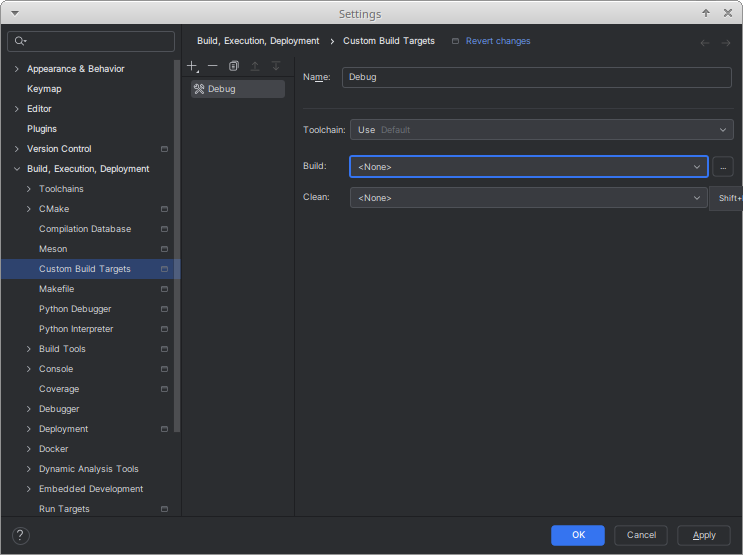

.. figure:: img/clion-external-tools-add.png
   :figclass: figure-w480
   :align: center

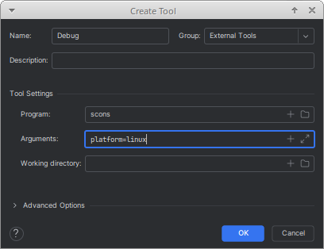

.. figure:: img/clion-external-tools-debug.png
   :figclass: figure-w480
   :align: center

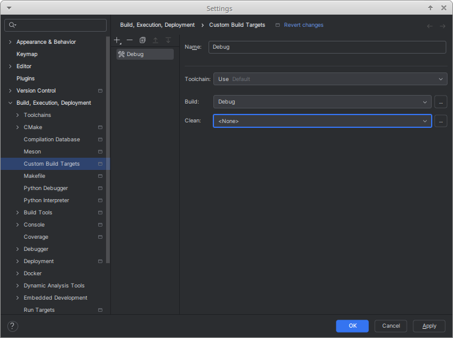

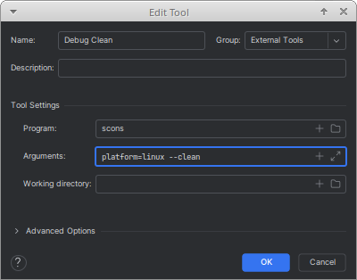

.. figure:: img/clion-debug-settings.png
   :figclass: figure-w480
   :align: center

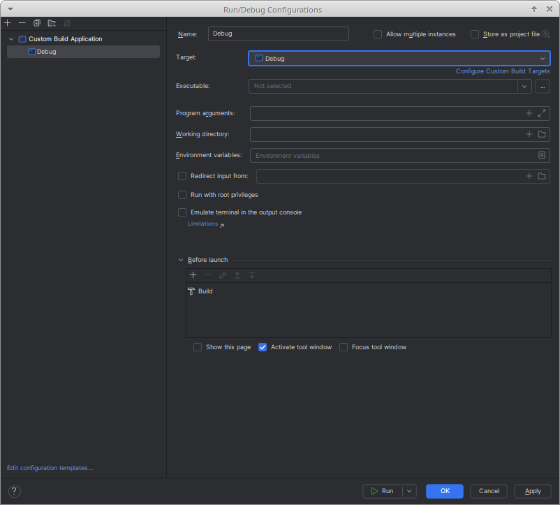

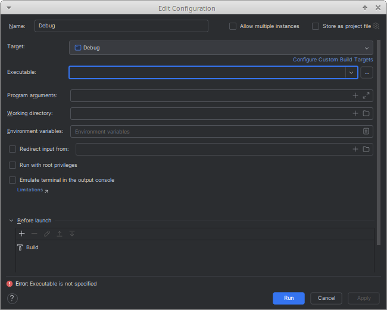

.. figure:: img/clion-select-executable.png
   :figclass: figure-w480
   :align: center

