Code::Blocks
============

`Code::Blocks <https://www.codeblocks.org/>`_ is a free, open source, cross platform IDE.

.. _create-new-project:

Create a new project
--------------------

From Code::Blocks' main screen,
click **Create a new project** or select **File > New > Project...**

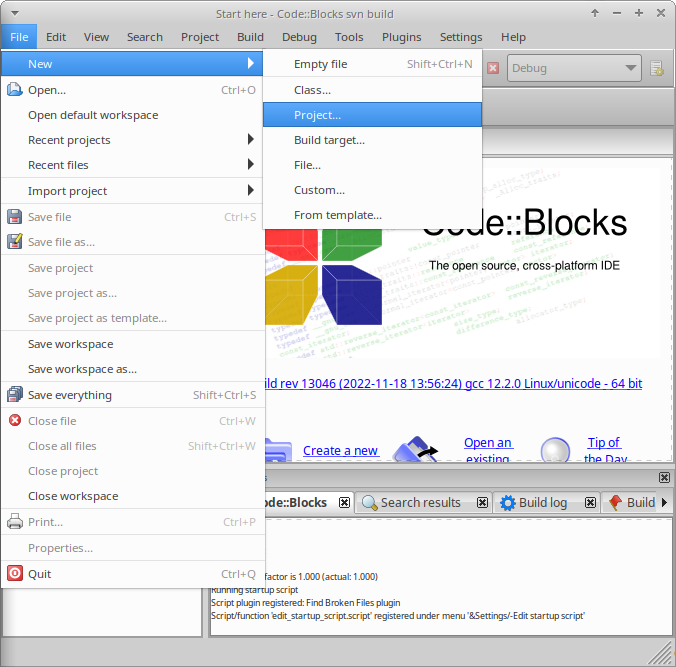

In the **New project** window,
from **Projects**, select **Empty project**, and click **Go**.

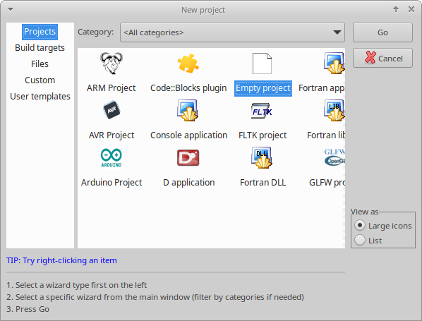

Click **Next >** to pass the welcome to the new empty project wizard.

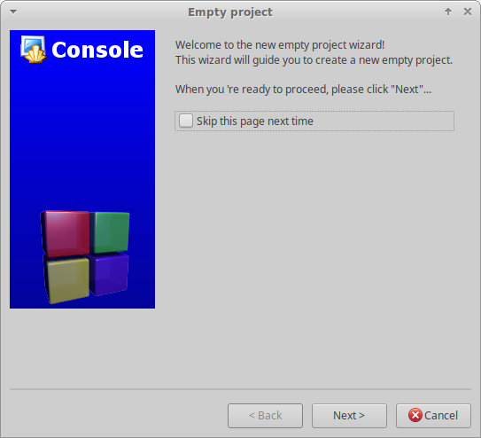

The Code::Blocks project file needs to be created in the root of the cloned project folder.
To achieve this,
first, ensure that the **Project title** is the same as the folder name that Rebel Engine was cloned into.
Unless you renamed the folder, this will be ``RebelEngine``.

Second, ensure that the **Folder to create project in** is the folder you ran the Git clone command from;
not the ``RebelEngine`` project folder.
Confirm that the **Resulting filename** field will create the Code:Blocks project file (``.cbp``) in the root of the cloned project folder.

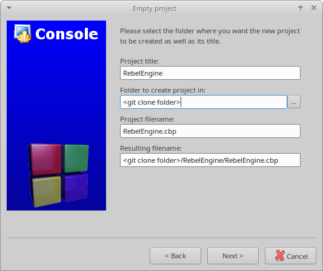

When you are sure the Code::Blocks project file will be created in the project root folder,
click **Next >**.

The compiler and configuration settings are managed through **SCons**.
These will be configured later.
However, it's worth deselecting the **Create "Release" configuration** option;
so only a single build target is created before clicking **Finish**.

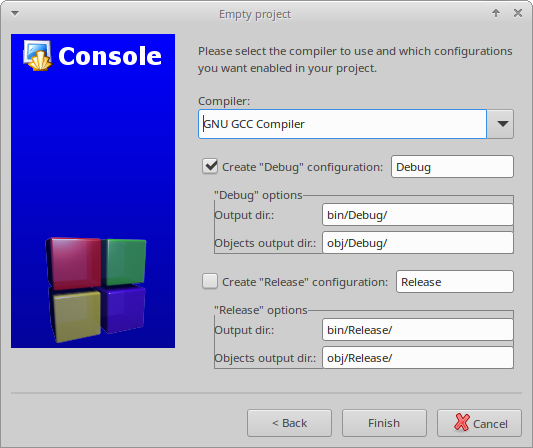

Add Rebel files to the project
------------------------------

To add all the Rebel source files to the project,
right-click on the **RebelEngine** project and select **Add files recursively...**.

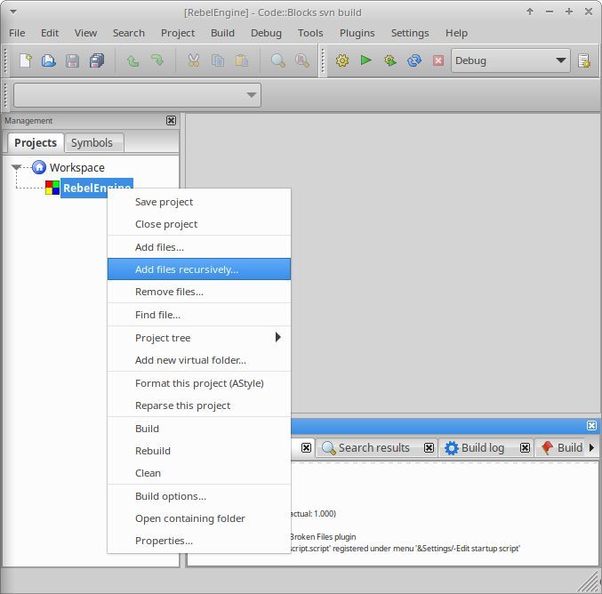

It should automatically select the project root folder.

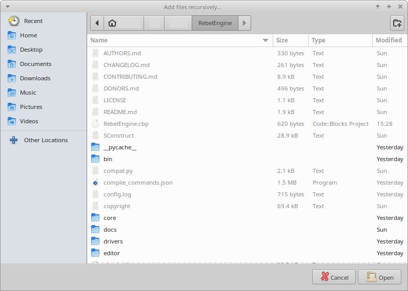

If you don't see the project root folder,
you probably didn't create the Code::Blocks project file in the project root folder.
Go back to :ref:`create-new-project`, and recreate the **RebelEngine** project.
Ensure that, the **Resulting filename** field will create the Code:Blocks project file (``.cbp``) in the root of the cloned project folder.

If you do see the project root folder, simply click **Open**.
By default, all code files are included; so simply click **OK**.

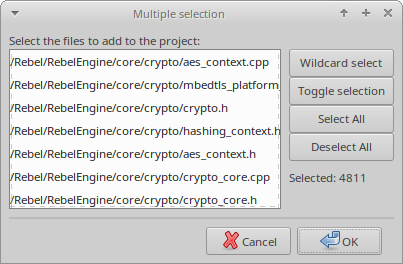

As improvements are made to Rebel Engine,
files and folders are added, removed and renamed.
Code::Blocks does not automatically update the files and folders;
unless you are personally making the changes.
Whenever you want to update the project's files and folders,
simply, right-click on the **RebelEngine** project and select **Remove files...**.

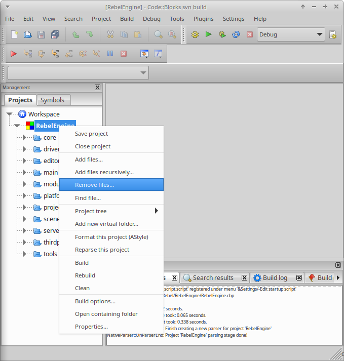

This will remove all the project's files and folders.
Now, simply **Add files recursively...** again.

Configure the build
-------------------

The first step is to change the project properties.
Right-click on the new project and select **Properties...**.

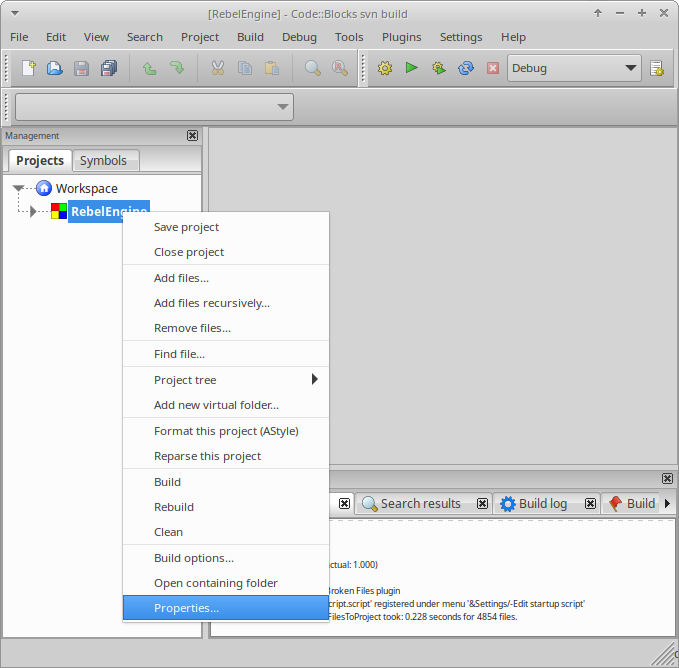

Check the **This is a custom Makefile** property.

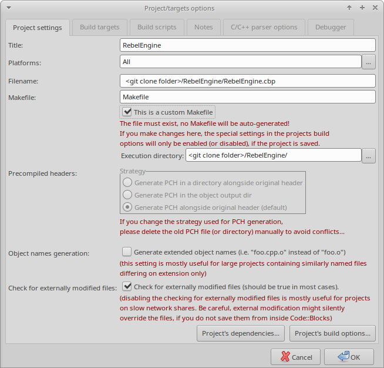

Click **OK** to save the changes.

The next step is to change the build options.
Right-click on the **RebelProject** project and select **Build Options...**.

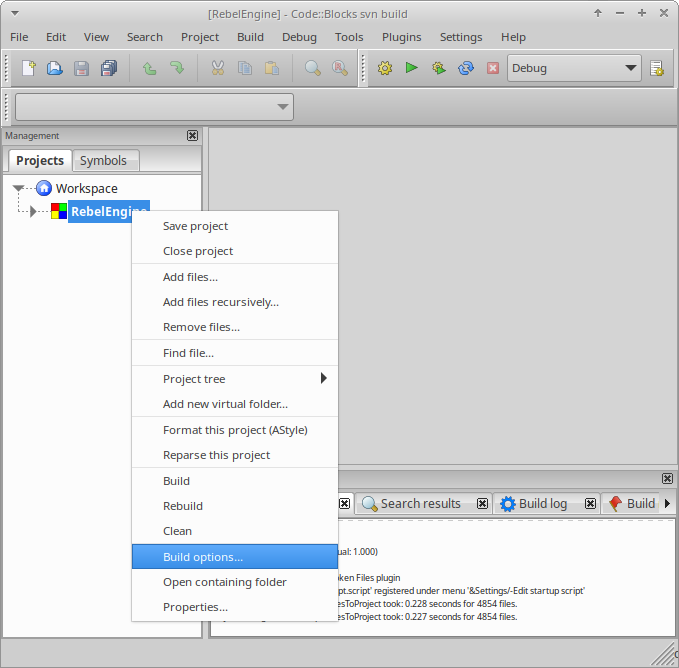

Select the **"Make" commands** tab.
Remove all the existing commands for all the build targets.
For each build target enter the **SCons** command for creating the desired build in the **Build project/target** field.
The minimum is ``scons``.
For details on the **SCons** build options,
see :doc:`/development/compiling/introduction_to_the_buildsystem`.
It's also useful to add the ``scons --clean`` command in the **Clean project/target** field.

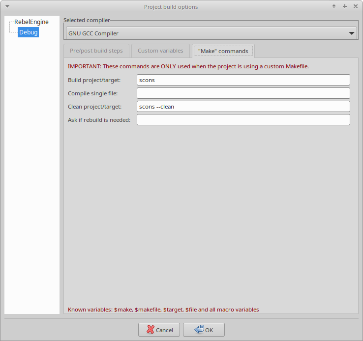

If you're using Windows,
all the commands need to be preceded with ``cmd /c`` to initialize the command interpreter.

.. figure:: img/code-blocks-windows-build-options.png
   :figclass: figure-w480
   :align: center

Code::Blocks should now be configured to build Rebel Engine.
You can either select **Build > Build**, click the gear button, or press :kbd:`Ctrl + F9`.

Configure the run
-----------------

Once **SCons** has successfully built the desired target,
reopen the project **Properties...**.
Select the **Build targets** tab.
In the **Output filename** field, browse to the ``bin`` folder and select the compiled file.

Deselect the **Auto-generate filename prefix** and **Auto-generate filename extension** options.

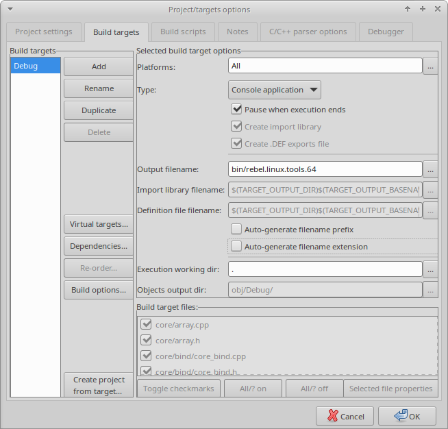

There are two additional points worth noting:

1. If required, the **Execution working dir** field can be used to test specific projects. Set it to the folder containing the ``project.rebel`` file.

2. The **Build targets** tab can be used to add and remove build targets for working with and creating different builds.

Code::Blocks should now be configured to run your compiled Rebel Engine executable.
You can either select **Build > Run**, click the green arrow button, or press :kbd:`Ctrl + F10`.

Save your settings
------------------

By default, Code::Blocks does not save your workspace settings.
To avoid opening your project each time,
you can set Code::Blocks to open the default workspace on start-up.
Go to **Settings > Environment...**.

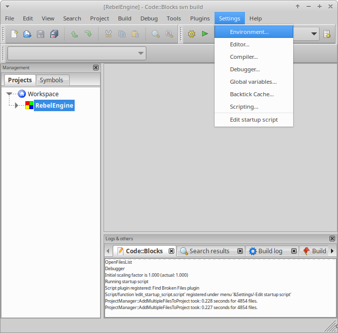

Under **General settings** find the **On application start-up** section.
Select the **Open default workspace** option.

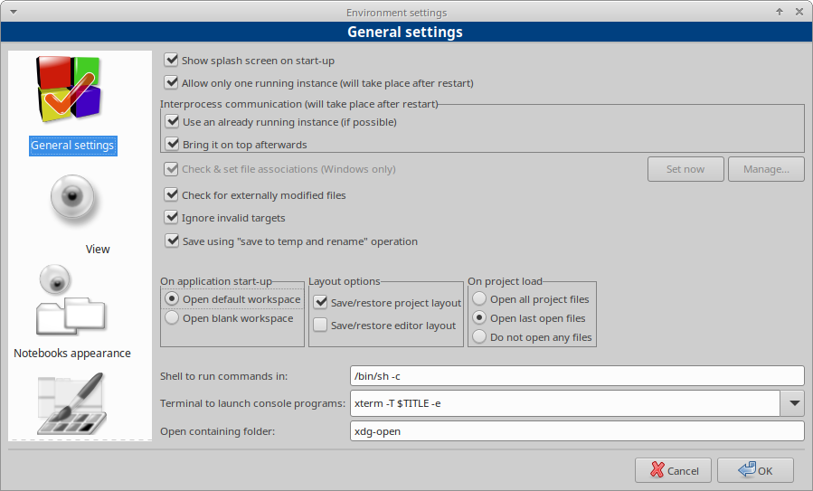

Click **Ok**.

When exiting,
you will be prompted to save the workspace.

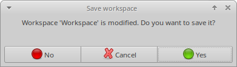

Then you will be prompted to save the project.

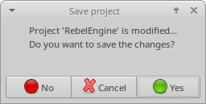

Please click **Yes**.
Otherwise, you will need to recreate all of these settings again.

That's it!
You're now ready to start contributing to Rebel Engine using the Code::Blocks IDE.
